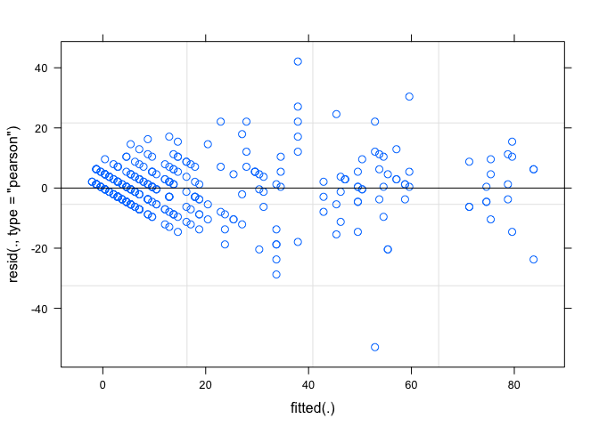
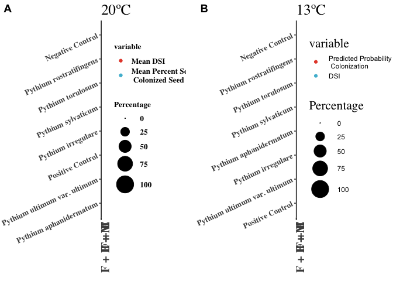
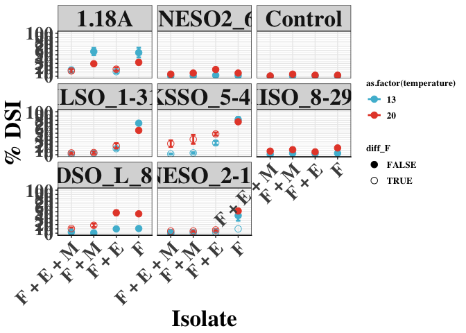

``` r
# ipak function: install and load multiple R packages.
# check to see if packages are installed. Install them if they are not, then load them into the R session.
# Source: https://gist.github.com/stevenworthington/3178163
ipak <- function(pkg){
new.pkg <- pkg[!(pkg %in% installed.packages()[,"Package"])]
if (length(new.pkg)) 
    install.packages(new.pkg, dependencies = TRUE)
sapply(pkg, require, character.only = TRUE)
}
```

    ## Loading required package: drc

    ## Loading required package: MASS

    ## 
    ## 'drc' has been loaded.

    ## Please cite R and 'drc' if used for a publication,

    ## for references type 'citation()' and 'citation('drc')'.

    ## 
    ## Attaching package: 'drc'

    ## The following objects are masked from 'package:stats':
    ## 
    ##     gaussian, getInitial

    ## Loading required package: lme4

    ## Loading required package: Matrix

    ## Loading required package: lsmeans

    ## The 'lsmeans' package is being deprecated.
    ## Users are encouraged to switch to 'emmeans'.
    ## See help('transition') for more information, including how
    ## to convert 'lsmeans' objects and scripts to work with 'emmeans'.

    ## Loading required package: plyr

    ## Loading required package: plotrix

    ## Loading required package: knitr

    ## Loading required package: ggplot2

    ## Loading required package: lmtest

    ## Loading required package: zoo

    ## 
    ## Attaching package: 'zoo'

    ## The following objects are masked from 'package:base':
    ## 
    ##     as.Date, as.Date.numeric

    ## Loading required package: lmerTest

    ## 
    ## Attaching package: 'lmerTest'

    ## The following object is masked from 'package:lme4':
    ## 
    ##     lmer

    ## The following object is masked from 'package:stats':
    ## 
    ##     step

    ## Loading required package: Rmisc

    ## Loading required package: lattice

    ## Loading required package: gridExtra

    ## Loading required package: plotly

    ## 
    ## Attaching package: 'plotly'

    ## The following object is masked from 'package:ggplot2':
    ## 
    ##     last_plot

    ## The following objects are masked from 'package:plyr':
    ## 
    ##     arrange, mutate, rename, summarise

    ## The following object is masked from 'package:MASS':
    ## 
    ##     select

    ## The following object is masked from 'package:stats':
    ## 
    ##     filter

    ## The following object is masked from 'package:graphics':
    ## 
    ##     layout

    ## Loading required package: webshot

    ## Loading required package: ggpmisc

    ## For news about 'ggpmisc', please, see https://www.r4photobiology.info/

    ## For on-line documentation see https://docs.r4photobiology.info/ggpmisc/

    ## Loading required package: multcompView

    ## Loading required package: ggsci

    ## Loading required package: AER

    ## Loading required package: car

    ## Loading required package: carData

    ## Loading required package: sandwich

    ## Loading required package: survival

    ## Loading required package: multcomp

    ## Loading required package: mvtnorm

    ## Loading required package: TH.data

    ## 
    ## Attaching package: 'TH.data'

    ## The following object is masked from 'package:MASS':
    ## 
    ##     geyser

    ## Loading required package: ggpubr

    ## Loading required package: magrittr

    ## Loading required package: cowplot

    ## 
    ## Attaching package: 'cowplot'

    ## The following object is masked from 'package:ggpubr':
    ## 
    ##     get_legend

    ## The following object is masked from 'package:ggplot2':
    ## 
    ##     ggsave

    ## Loading required package: emmeans

    ## NOTE: As of emmeans versions > 1.2.3,
    ##       The 'cld' function will be deprecated in favor of 'CLD'.
    ##       You may use 'cld' only if you have package:multcomp attached.

    ## 
    ## Attaching package: 'emmeans'

    ## The following object is masked from 'package:multcomp':
    ## 
    ##     cld

    ## The following objects are masked from 'package:lsmeans':
    ## 
    ##     .all.vars, .aovlist.dffun, .diag, .get.offset, .my.vcov,
    ##     add_grouping, as.glht, cld, contrast, get.lsm.option, lsm,
    ##     lsm.basis, lsm.options, lsmeans, lsmip, lsmobj, lstrends,
    ##     make.tran, pmm, pmmeans, pmmip, pmmobj, pmtrends,
    ##     recover.data, ref.grid, regrid, test

``` r
seedrot <- read.csv("seedinfectionassay_clean.csv") #%DI data 
```

Analysing the DSI ratings:

With temperature in the linear model

``` r
seedrot$treatment_name <- ordered(seedrot$treatment_name, levels = c("F", "F + E", "F + M", "F + E + M"))
seedrot$DI <- 100*(seedrot$DI)

mod_DI <- lm(DI ~ treatment_name*isolate*as.factor(temperature), data = seedrot)
#plot(mod.13)
anova(mod_DI)
```

    ## Analysis of Variance Table
    ## 
    ## Response: DI
    ##                                                Df Sum Sq Mean Sq  F value
    ## treatment_name                                  3  43920 14640.0 165.7849
    ## isolate                                         7  52214  7459.2  84.4686
    ## as.factor(temperature)                          1   4401  4401.0  49.8378
    ## treatment_name:isolate                         21  48826  2325.0  26.3289
    ## treatment_name:as.factor(temperature)           3    959   319.6   3.6194
    ## isolate:as.factor(temperature)                  7  10449  1492.7  16.9036
    ## treatment_name:isolate:as.factor(temperature)  21   6954   331.1   3.7497
    ## Residuals                                     320  28258    88.3         
    ##                                                  Pr(>F)    
    ## treatment_name                                < 2.2e-16 ***
    ## isolate                                       < 2.2e-16 ***
    ## as.factor(temperature)                        1.043e-11 ***
    ## treatment_name:isolate                        < 2.2e-16 ***
    ## treatment_name:as.factor(temperature)            0.0135 *  
    ## isolate:as.factor(temperature)                < 2.2e-16 ***
    ## treatment_name:isolate:as.factor(temperature) 1.421e-07 ***
    ## Residuals                                                  
    ## ---
    ## Signif. codes:  0 '***' 0.001 '**' 0.01 '*' 0.05 '.' 0.1 ' ' 1

``` r
mod1_DI <- lmer(DI ~ treatment_name*isolate*as.factor(temperature) + (1|biorep), data = seedrot)
plot(mod1_DI)
```



``` r
anova(mod1_DI)
```

    ## Type III Analysis of Variance Table with Satterthwaite's method
    ##                                               Sum Sq Mean Sq NumDF DenDF
    ## treatment_name                                 43920 14640.0     3   319
    ## isolate                                        52214  7459.2     7   319
    ## as.factor(temperature)                          4401  4401.0     1   319
    ## treatment_name:isolate                         48826  2325.0    21   319
    ## treatment_name:as.factor(temperature)            959   319.6     3   319
    ## isolate:as.factor(temperature)                 10449  1492.7     7   319
    ## treatment_name:isolate:as.factor(temperature)   6954   331.1    21   319
    ##                                               F value    Pr(>F)    
    ## treatment_name                                176.761 < 2.2e-16 ***
    ## isolate                                        90.061 < 2.2e-16 ***
    ## as.factor(temperature)                         53.137 2.466e-12 ***
    ## treatment_name:isolate                         28.072 < 2.2e-16 ***
    ## treatment_name:as.factor(temperature)           3.859  0.009795 ** 
    ## isolate:as.factor(temperature)                 18.023 < 2.2e-16 ***
    ## treatment_name:isolate:as.factor(temperature)   3.998 2.859e-08 ***
    ## ---
    ## Signif. codes:  0 '***' 0.001 '**' 0.01 '*' 0.05 '.' 0.1 ' ' 1

``` r
AIC(mod_DI)
```

    ## [1] 2870.369

``` r
AIC(mod1_DI) # the AIC is less, go with mod1 
```

    ## [1] 2593.423

Significnt interaction was noticed, so we will look at the differences within groups of treatment and isolate First we have to decide which isolates are good colonizers

``` r
lsmeans_CvsA_DI <- emmeans(mod1_DI, ~isolate|treatment_name|temperature) # estimate lsmeans of isolates and compare them to the control to see which were pathogenic

# testing which isolate causes disease on fludioxonil signifincalty more than the control
# if they cause disease significanlty better than the control on fludioxonil treated seed 
# this defines which are pathogenic
CvsA_mod1_DI <- emmeans::contrast(lsmeans_CvsA_DI, "trt.vs.ctrl", ref = 3, adjust = "tuk")
# shows contrasts - in this case we really only care about the F treatment in 13 and 20ºC
CvsA_mod1_DI
```

    ## treatment_name = F, temperature = 13:
    ##  contrast                   estimate       SE  df t.ratio p.value
    ##  1.18A - Control        5.416667e+01 5.254329 319  10.309  <.0001
    ##  C-NESO2_6-5 - Control  8.333333e-01 5.254329 319   0.159  1.0000
    ##  ILSO_1-31 - Control    7.250000e+01 5.254329 319  13.798  <.0001
    ##  KSSO_5-45 - Control    8.083333e+01 5.254329 319  15.384  <.0001
    ##  MISO_8-29.1 - Control  2.500000e+00 5.254329 319   0.476  0.9991
    ##  NDSO_L_8-6 - Control   1.000000e+01 5.254329 319   1.903  0.3414
    ##  NESO_2-13 - Control    3.500000e+01 5.254329 319   6.661  <.0001
    ## 
    ## treatment_name = F + E, temperature = 13:
    ##  contrast                   estimate       SE  df t.ratio p.value
    ##  1.18A - Control        1.000000e+01 5.254329 319   1.903  0.3414
    ##  C-NESO2_6-5 - Control  1.666667e+00 5.254329 319   0.317  0.9999
    ##  ILSO_1-31 - Control    1.333333e+01 5.254329 319   2.538  0.0787
    ##  KSSO_5-45 - Control    2.666667e+01 5.254329 319   5.075  <.0001
    ##  MISO_8-29.1 - Control  1.666667e+00 5.254329 319   0.317  0.9999
    ##  NDSO_L_8-6 - Control   9.166667e+00 5.254329 319   1.745  0.4507
    ##  NESO_2-13 - Control    1.666667e+00 5.254329 319   0.317  0.9999
    ## 
    ## treatment_name = F + M, temperature = 13:
    ##  contrast                   estimate       SE  df t.ratio p.value
    ##  1.18A - Control        5.666667e+01 5.254329 319  10.785  <.0001
    ##  C-NESO2_6-5 - Control -6.328271e-15 5.254329 319   0.000  1.0000
    ##  ILSO_1-31 - Control    2.500000e+00 5.254329 319   0.476  0.9991
    ##  KSSO_5-45 - Control    3.333333e+00 5.254329 319   0.634  0.9946
    ##  MISO_8-29.1 - Control  2.500000e+00 5.254329 319   0.476  0.9991
    ##  NDSO_L_8-6 - Control   2.287059e-14 5.254329 319   0.000  1.0000
    ##  NESO_2-13 - Control   -2.886580e-15 5.254329 319   0.000  1.0000
    ## 
    ## treatment_name = F + E + M, temperature = 13:
    ##  contrast                   estimate       SE  df t.ratio p.value
    ##  1.18A - Control        1.500000e+01 5.254329 319   2.855  0.0317
    ##  C-NESO2_6-5 - Control  8.333333e-01 5.254329 319   0.159  1.0000
    ##  ILSO_1-31 - Control    8.333333e-01 5.254329 319   0.159  1.0000
    ##  KSSO_5-45 - Control    1.666667e+00 5.254329 319   0.317  0.9999
    ##  MISO_8-29.1 - Control  8.333333e-01 5.254329 319   0.159  1.0000
    ##  NDSO_L_8-6 - Control   2.500000e+00 5.254329 319   0.476  0.9991
    ##  NESO_2-13 - Control    8.333333e-01 5.254329 319   0.159  1.0000
    ## 
    ## treatment_name = F, temperature = 20:
    ##  contrast                   estimate       SE  df t.ratio p.value
    ##  1.18A - Control        3.000000e+01 5.254329 319   5.710  <.0001
    ##  C-NESO2_6-5 - Control  5.000000e+00 5.254329 319   0.952  0.9466
    ##  ILSO_1-31 - Control    5.416667e+01 5.254329 319  10.309  <.0001
    ##  KSSO_5-45 - Control    7.416667e+01 5.254329 319  14.115  <.0001
    ##  MISO_8-29.1 - Control  1.333333e+01 5.254329 319   2.538  0.0787
    ##  NDSO_L_8-6 - Control   4.250000e+01 5.254329 319   8.089  <.0001
    ##  NESO_2-13 - Control    4.916667e+01 5.254329 319   9.357  <.0001
    ## 
    ## treatment_name = F + E, temperature = 20:
    ##  contrast                   estimate       SE  df t.ratio p.value
    ##  1.18A - Control        1.416667e+01 5.254329 319   2.696  0.0506
    ##  C-NESO2_6-5 - Control  1.333333e+01 5.254329 319   2.538  0.0787
    ##  ILSO_1-31 - Control    1.833333e+01 5.254329 319   3.489  0.0039
    ##  KSSO_5-45 - Control    4.583333e+01 5.254329 319   8.723  <.0001
    ##  MISO_8-29.1 - Control  4.166667e+00 5.254329 319   0.793  0.9801
    ##  NDSO_L_8-6 - Control   4.500000e+01 5.254329 319   8.564  <.0001
    ##  NESO_2-13 - Control    5.000000e+00 5.254329 319   0.952  0.9466
    ## 
    ## treatment_name = F + M, temperature = 20:
    ##  contrast                   estimate       SE  df t.ratio p.value
    ##  1.18A - Control        2.416667e+01 5.254329 319   4.599  <.0001
    ##  C-NESO2_6-5 - Control  2.500000e+00 5.254329 319   0.476  0.9991
    ##  ILSO_1-31 - Control   -5.578871e-15 5.254329 319   0.000  1.0000
    ##  KSSO_5-45 - Control    3.083333e+01 5.254329 319   5.868  <.0001
    ##  MISO_8-29.1 - Control  6.666667e+00 5.254329 319   1.269  0.8001
    ##  NDSO_L_8-6 - Control   1.333333e+01 5.254329 319   2.538  0.0787
    ##  NESO_2-13 - Control   -4.912737e-15 5.254329 319   0.000  1.0000
    ## 
    ## treatment_name = F + E + M, temperature = 20:
    ##  contrast                   estimate       SE  df t.ratio p.value
    ##  1.18A - Control        1.166667e+01 5.254329 319   2.220  0.1749
    ##  C-NESO2_6-5 - Control  4.166667e+00 5.254329 319   0.793  0.9801
    ##  ILSO_1-31 - Control    3.333333e+00 5.254329 319   0.634  0.9946
    ##  KSSO_5-45 - Control    2.500000e+01 5.254329 319   4.758  <.0001
    ##  MISO_8-29.1 - Control  7.500000e+00 5.254329 319   1.427  0.6910
    ##  NDSO_L_8-6 - Control   1.000000e+01 5.254329 319   1.903  0.3414
    ##  NESO_2-13 - Control    4.166667e+00 5.254329 319   0.793  0.9801
    ## 
    ## P value adjustment: sidak method for 7 tests

``` r
lsmeans_treatment_DI <- emmeans(mod1_DI, ~treatment_name|isolate|temperature) # estimate lsmeans of isolates and compare them within isolate which treatments worked the best

treatment_mod1_DI <- emmeans::contrast(lsmeans_treatment_DI, "trt.vs.ctrl", ref = 1, adjust = "tuk") # testing the effect of each treatment within each isolate 
# shows contrasts 
treatment_mod1_DI
```

    ## isolate = 1.18A, temperature = 13:
    ##  contrast           estimate       SE  df t.ratio p.value
    ##  F + E - F     -4.416667e+01 5.254329 319  -8.406  <.0001
    ##  F + M - F      2.500000e+00 5.254329 319   0.476  0.9512
    ##  F + E + M - F -4.000000e+01 5.254329 319  -7.613  <.0001
    ## 
    ## isolate = C-NESO2_6-5, temperature = 13:
    ##  contrast           estimate       SE  df t.ratio p.value
    ##  F + E - F      8.333333e-01 5.254329 319   0.159  0.9980
    ##  F + M - F     -8.333333e-01 5.254329 319  -0.159  0.9980
    ##  F + E + M - F -8.333333e-01 5.254329 319  -0.159  0.9980
    ## 
    ## isolate = Control, temperature = 13:
    ##  contrast           estimate       SE  df t.ratio p.value
    ##  F + E - F     -1.587619e-14 5.254329 319   0.000  1.0000
    ##  F + M - F      1.521006e-14 5.254329 319   0.000  1.0000
    ##  F + E + M - F -8.333333e-01 5.254329 319  -0.159  0.9980
    ## 
    ## isolate = ILSO_1-31, temperature = 13:
    ##  contrast           estimate       SE  df t.ratio p.value
    ##  F + E - F     -5.916667e+01 5.254329 319 -11.261  <.0001
    ##  F + M - F     -7.000000e+01 5.254329 319 -13.322  <.0001
    ##  F + E + M - F -7.250000e+01 5.254329 319 -13.798  <.0001
    ## 
    ## isolate = KSSO_5-45, temperature = 13:
    ##  contrast           estimate       SE  df t.ratio p.value
    ##  F + E - F     -5.416667e+01 5.254329 319 -10.309  <.0001
    ##  F + M - F     -7.750000e+01 5.254329 319 -14.750  <.0001
    ##  F + E + M - F -8.000000e+01 5.254329 319 -15.226  <.0001
    ## 
    ## isolate = MISO_8-29.1, temperature = 13:
    ##  contrast           estimate       SE  df t.ratio p.value
    ##  F + E - F     -8.333333e-01 5.254329 319  -0.159  0.9980
    ##  F + M - F      2.209344e-14 5.254329 319   0.000  1.0000
    ##  F + E + M - F -2.500000e+00 5.254329 319  -0.476  0.9512
    ## 
    ## isolate = NDSO_L_8-6, temperature = 13:
    ##  contrast           estimate       SE  df t.ratio p.value
    ##  F + E - F     -8.333333e-01 5.254329 319  -0.159  0.9980
    ##  F + M - F     -1.000000e+01 5.254329 319  -1.903  0.1639
    ##  F + E + M - F -8.333333e+00 5.254329 319  -1.586  0.3039
    ## 
    ## isolate = NESO_2-13, temperature = 13:
    ##  contrast           estimate       SE  df t.ratio p.value
    ##  F + E - F     -3.333333e+01 5.254329 319  -6.344  <.0001
    ##  F + M - F     -3.500000e+01 5.254329 319  -6.661  <.0001
    ##  F + E + M - F -3.500000e+01 5.254329 319  -6.661  <.0001
    ## 
    ## isolate = 1.18A, temperature = 20:
    ##  contrast           estimate       SE  df t.ratio p.value
    ##  F + E - F     -1.583333e+01 5.254329 319  -3.013  0.0083
    ##  F + M - F     -3.333333e+00 5.254329 319  -0.634  0.8937
    ##  F + E + M - F -2.000000e+01 5.254329 319  -3.806  0.0005
    ## 
    ## isolate = C-NESO2_6-5, temperature = 20:
    ##  contrast           estimate       SE  df t.ratio p.value
    ##  F + E - F      8.333333e+00 5.254329 319   1.586  0.3039
    ##  F + M - F     -2.997602e-15 5.254329 319   0.000  1.0000
    ##  F + E + M - F -2.500000e+00 5.254329 319  -0.476  0.9512
    ## 
    ## isolate = Control, temperature = 20:
    ##  contrast           estimate       SE  df t.ratio p.value
    ##  F + E - F      5.273559e-15 5.254329 319   0.000  1.0000
    ##  F + M - F      2.500000e+00 5.254329 319   0.476  0.9512
    ##  F + E + M - F -1.666667e+00 5.254329 319  -0.317  0.9846
    ## 
    ## isolate = ILSO_1-31, temperature = 20:
    ##  contrast           estimate       SE  df t.ratio p.value
    ##  F + E - F     -3.583333e+01 5.254329 319  -6.820  <.0001
    ##  F + M - F     -5.166667e+01 5.254329 319  -9.833  <.0001
    ##  F + E + M - F -5.250000e+01 5.254329 319  -9.992  <.0001
    ## 
    ## isolate = KSSO_5-45, temperature = 20:
    ##  contrast           estimate       SE  df t.ratio p.value
    ##  F + E - F     -2.833333e+01 5.254329 319  -5.392  <.0001
    ##  F + M - F     -4.083333e+01 5.254329 319  -7.771  <.0001
    ##  F + E + M - F -5.083333e+01 5.254329 319  -9.675  <.0001
    ## 
    ## isolate = MISO_8-29.1, temperature = 20:
    ##  contrast           estimate       SE  df t.ratio p.value
    ##  F + E - F     -9.166667e+00 5.254329 319  -1.745  0.2264
    ##  F + M - F     -4.166667e+00 5.254329 319  -0.793  0.8132
    ##  F + E + M - F -7.500000e+00 5.254329 319  -1.427  0.3955
    ## 
    ## isolate = NDSO_L_8-6, temperature = 20:
    ##  contrast           estimate       SE  df t.ratio p.value
    ##  F + E - F      2.500000e+00 5.254329 319   0.476  0.9512
    ##  F + M - F     -2.666667e+01 5.254329 319  -5.075  <.0001
    ##  F + E + M - F -3.416667e+01 5.254329 319  -6.503  <.0001
    ## 
    ## isolate = NESO_2-13, temperature = 20:
    ##  contrast           estimate       SE  df t.ratio p.value
    ##  F + E - F     -4.416667e+01 5.254329 319  -8.406  <.0001
    ##  F + M - F     -4.666667e+01 5.254329 319  -8.882  <.0001
    ##  F + E + M - F -4.666667e+01 5.254329 319  -8.882  <.0001
    ## 
    ## P value adjustment: sidak method for 3 tests

``` r
#Summarizing data using different parameters by plyr library
seed_sum <- ddply(seedrot, c("isolate", "species", "treatment_name", "temperature"), summarise,
              N_DI = length(DI),
              mean_DI = mean(DI), 
              sd_DI = sd(DI),
              se_DI = sd_DI/sqrt(N_DI),
              N_seedcol = length(percent_col),
              mean_seedcol = mean(percent_col), 
              sd_seedcol = sd(percent_col),
              se_seedcol = sd(percent_col)/sqrt(N_seedcol)
)
kable(seed_sum)
```

| isolate      | species                      | treatment\_name |  temperature|  N\_DI|    mean\_DI|     sd\_DI|      se\_DI|  N\_seedcol|  mean\_seedcol|  sd\_seedcol|  se\_seedcol|
|:-------------|:-----------------------------|:----------------|------------:|------:|-----------:|----------:|-----------:|-----------:|--------------:|------------:|------------:|
| 1.18A        | Positive Control             | F               |           13|      6|  55.0000000|  27.568098|  11.2546287|           6|      83.333333|    40.824829|    16.666667|
| 1.18A        | Positive Control             | F               |           20|      6|  32.5000000|  12.144958|   4.9581583|           6|      96.666667|     8.164966|     3.333333|
| 1.18A        | Positive Control             | F + E           |           13|      6|  10.8333333|   8.612007|   3.5158372|           6|      26.666667|    39.327683|    16.055459|
| 1.18A        | Positive Control             | F + E           |           20|      6|  16.6666667|   9.831921|   4.0138649|           6|       3.333333|     8.164966|     3.333333|
| 1.18A        | Positive Control             | F + M           |           13|      6|  57.5000000|  20.676073|   8.4409715|           6|      76.666667|    26.583203|    10.852547|
| 1.18A        | Positive Control             | F + M           |           20|      6|  29.1666667|  10.206207|   4.1666667|           6|      93.333333|    16.329932|     6.666667|
| 1.18A        | Positive Control             | F + E + M       |           13|      6|  15.0000000|  10.000000|   4.0824829|           6|      10.000000|    16.733200|     6.831301|
| 1.18A        | Positive Control             | F + E + M       |           20|      6|  12.5000000|   9.354143|   3.8188131|           6|       0.000000|     0.000000|     0.000000|
| C-NESO2\_6-5 | Pythium rostratifingens      | F               |           13|      6|   1.6666667|   2.581989|   1.0540926|           6|       0.000000|     0.000000|     0.000000|
| C-NESO2\_6-5 | Pythium rostratifingens      | F               |           20|      6|   7.5000000|   6.892024|   2.8136572|           6|       0.000000|     0.000000|     0.000000|
| C-NESO2\_6-5 | Pythium rostratifingens      | F + E           |           13|      6|   2.5000000|   6.123724|   2.5000000|           6|       0.000000|     0.000000|     0.000000|
| C-NESO2\_6-5 | Pythium rostratifingens      | F + E           |           20|      6|  15.8333333|   9.174239|   3.7453675|           6|       0.000000|     0.000000|     0.000000|
| C-NESO2\_6-5 | Pythium rostratifingens      | F + M           |           13|      6|   0.8333333|   2.041241|   0.8333333|           6|       0.000000|     0.000000|     0.000000|
| C-NESO2\_6-5 | Pythium rostratifingens      | F + M           |           20|      6|   7.5000000|   8.215838|   3.3541020|           6|       3.333333|     8.164966|     3.333333|
| C-NESO2\_6-5 | Pythium rostratifingens      | F + E + M       |           13|      6|   0.8333333|   2.041241|   0.8333333|           6|       0.000000|     0.000000|     0.000000|
| C-NESO2\_6-5 | Pythium rostratifingens      | F + E + M       |           20|      6|   5.0000000|   5.477226|   2.2360680|           6|       0.000000|     0.000000|     0.000000|
| Control      | Negative Control             | F               |           13|      6|   0.8333333|   2.041241|   0.8333333|           6|       0.000000|     0.000000|     0.000000|
| Control      | Negative Control             | F               |           20|      6|   2.5000000|   2.738613|   1.1180340|           6|       0.000000|     0.000000|     0.000000|
| Control      | Negative Control             | F + E           |           13|      6|   0.8333333|   2.041241|   0.8333333|           6|       0.000000|     0.000000|     0.000000|
| Control      | Negative Control             | F + E           |           20|      6|   2.5000000|   2.738613|   1.1180340|           6|       0.000000|     0.000000|     0.000000|
| Control      | Negative Control             | F + M           |           13|      6|   0.8333333|   2.041241|   0.8333333|           6|       0.000000|     0.000000|     0.000000|
| Control      | Negative Control             | F + M           |           20|      6|   5.0000000|   4.472136|   1.8257419|           6|       3.333333|     8.164966|     3.333333|
| Control      | Negative Control             | F + E + M       |           13|      6|   0.0000000|   0.000000|   0.0000000|           6|       0.000000|     0.000000|     0.000000|
| Control      | Negative Control             | F + E + M       |           20|      6|   0.8333333|   2.041241|   0.8333333|           6|       0.000000|     0.000000|     0.000000|
| ILSO\_1-31   | Pythium irregulare           | F               |           13|      6|  73.3333333|   9.309493|   3.8005848|           6|     100.000000|     0.000000|     0.000000|
| ILSO\_1-31   | Pythium irregulare           | F               |           20|      6|  56.6666667|   6.831301|   2.7888668|           6|      66.666667|    27.325202|    11.155467|
| ILSO\_1-31   | Pythium irregulare           | F + E           |           13|      6|  14.1666667|   8.010410|   3.2702361|           6|       3.333333|     8.164966|     3.333333|
| ILSO\_1-31   | Pythium irregulare           | F + E           |           20|      6|  20.8333333|  14.288690|   5.8333333|           6|      16.666667|    15.055453|     6.146363|
| ILSO\_1-31   | Pythium irregulare           | F + M           |           13|      6|   3.3333333|   2.581989|   1.0540926|           6|       0.000000|     0.000000|     0.000000|
| ILSO\_1-31   | Pythium irregulare           | F + M           |           20|      6|   5.0000000|   7.745967|   3.1622777|           6|       0.000000|     0.000000|     0.000000|
| ILSO\_1-31   | Pythium irregulare           | F + E + M       |           13|      6|   0.8333333|   2.041241|   0.8333333|           6|       0.000000|     0.000000|     0.000000|
| ILSO\_1-31   | Pythium irregulare           | F + E + M       |           20|      6|   4.1666667|   5.845226|   2.3863035|           6|       0.000000|     0.000000|     0.000000|
| KSSO\_5-45   | Pythium ultimum var. ultimum | F               |           13|      6|  81.6666667|  15.055453|   6.1463630|           6|     100.000000|     0.000000|     0.000000|
| KSSO\_5-45   | Pythium ultimum var. ultimum | F               |           20|      6|  76.6666667|   7.527726|   3.0731815|           6|     100.000000|     0.000000|     0.000000|
| KSSO\_5-45   | Pythium ultimum var. ultimum | F + E           |           13|      6|  27.5000000|   9.874209|   4.0311289|           6|      76.666667|    26.583203|    10.852547|
| KSSO\_5-45   | Pythium ultimum var. ultimum | F + E           |           20|      6|  48.3333333|   8.164966|   3.3333333|           6|      43.333333|    32.041640|    13.080945|
| KSSO\_5-45   | Pythium ultimum var. ultimum | F + M           |           13|      6|   4.1666667|   3.763863|   1.5365907|           6|       0.000000|     0.000000|     0.000000|
| KSSO\_5-45   | Pythium ultimum var. ultimum | F + M           |           20|      6|  35.8333333|  25.576682|  10.4416367|           6|       3.333333|     8.164966|     3.333333|
| KSSO\_5-45   | Pythium ultimum var. ultimum | F + E + M       |           13|      6|   1.6666667|   2.581989|   1.0540926|           6|       0.000000|     0.000000|     0.000000|
| KSSO\_5-45   | Pythium ultimum var. ultimum | F + E + M       |           20|      6|  25.8333333|  18.280226|   7.4628711|           6|       0.000000|     0.000000|     0.000000|
| MISO\_8-29.1 | Pythium torulosum            | F               |           13|      6|   3.3333333|   4.082483|   1.6666667|           6|       0.000000|     0.000000|     0.000000|
| MISO\_8-29.1 | Pythium torulosum            | F               |           20|      6|  15.8333333|   2.041241|   0.8333333|           6|      43.333333|    23.380904|     9.545214|
| MISO\_8-29.1 | Pythium torulosum            | F + E           |           13|      6|   2.5000000|   4.183300|   1.7078251|           6|       0.000000|     0.000000|     0.000000|
| MISO\_8-29.1 | Pythium torulosum            | F + E           |           20|      6|   6.6666667|   5.163978|   2.1081851|           6|      40.000000|    21.908902|     8.944272|
| MISO\_8-29.1 | Pythium torulosum            | F + M           |           13|      6|   3.3333333|   4.082483|   1.6666667|           6|       0.000000|     0.000000|     0.000000|
| MISO\_8-29.1 | Pythium torulosum            | F + M           |           20|      6|  11.6666667|   8.164966|   3.3333333|           6|       0.000000|     0.000000|     0.000000|
| MISO\_8-29.1 | Pythium torulosum            | F + E + M       |           13|      6|   0.8333333|   2.041241|   0.8333333|           6|       0.000000|     0.000000|     0.000000|
| MISO\_8-29.1 | Pythium torulosum            | F + E + M       |           20|      6|   8.3333333|   2.581989|   1.0540926|           6|       0.000000|     0.000000|     0.000000|
| NDSO\_L\_8-6 | Pythium aphanidermatum       | F               |           13|      6|  10.8333333|   7.359801|   3.0046261|           6|      46.666667|    51.639778|    21.081851|
| NDSO\_L\_8-6 | Pythium aphanidermatum       | F               |           20|      6|  45.0000000|   6.324555|   2.5819889|           6|     100.000000|     0.000000|     0.000000|
| NDSO\_L\_8-6 | Pythium aphanidermatum       | F + E           |           13|      6|  10.0000000|   7.071068|   2.8867513|           6|      60.000000|    33.466401|    13.662601|
| NDSO\_L\_8-6 | Pythium aphanidermatum       | F + E           |           20|      6|  47.5000000|  13.322913|   5.4390563|           6|      96.666667|     8.164966|     3.333333|
| NDSO\_L\_8-6 | Pythium aphanidermatum       | F + M           |           13|      6|   0.8333333|   2.041241|   0.8333333|           6|       0.000000|     0.000000|     0.000000|
| NDSO\_L\_8-6 | Pythium aphanidermatum       | F + M           |           20|      6|  18.3333333|   9.831921|   4.0138649|           6|      33.333333|    16.329932|     6.666667|
| NDSO\_L\_8-6 | Pythium aphanidermatum       | F + E + M       |           13|      6|   2.5000000|   2.738613|   1.1180340|           6|       0.000000|     0.000000|     0.000000|
| NDSO\_L\_8-6 | Pythium aphanidermatum       | F + E + M       |           20|      6|  10.8333333|   5.845226|   2.3863035|           6|       6.666667|    16.329932|     6.666667|
| NESO\_2-13   | Pythium sylvaticum           | F               |           13|      6|  35.8333333|  27.095510|  11.0616957|           6|      46.666667|    45.018515|    18.378732|
| NESO\_2-13   | Pythium sylvaticum           | F               |           20|      6|  51.6666667|  10.801234|   4.4095855|           6|      80.000000|    12.649111|     5.163978|
| NESO\_2-13   | Pythium sylvaticum           | F + E           |           13|      6|   2.5000000|   2.738613|   1.1180340|           6|       0.000000|     0.000000|     0.000000|
| NESO\_2-13   | Pythium sylvaticum           | F + E           |           20|      6|   7.5000000|   4.183300|   1.7078251|           6|       0.000000|     0.000000|     0.000000|
| NESO\_2-13   | Pythium sylvaticum           | F + M           |           13|      6|   0.8333333|   2.041241|   0.8333333|           6|       0.000000|     0.000000|     0.000000|
| NESO\_2-13   | Pythium sylvaticum           | F + M           |           20|      6|   5.0000000|   4.472136|   1.8257419|           6|       0.000000|     0.000000|     0.000000|
| NESO\_2-13   | Pythium sylvaticum           | F + E + M       |           13|      6|   0.8333333|   2.041241|   0.8333333|           6|       0.000000|     0.000000|     0.000000|
| NESO\_2-13   | Pythium sylvaticum           | F + E + M       |           20|      6|   5.0000000|   5.477226|   2.2360680|           6|       0.000000|     0.000000|     0.000000|

``` r
#write.csv(seed_sum, "seedrot_mean.csv")
```

``` r
colnames(seed_sum)
```

    ##  [1] "isolate"        "species"        "treatment_name" "temperature"   
    ##  [5] "N_DI"           "mean_DI"        "sd_DI"          "se_DI"         
    ##  [9] "N_seedcol"      "mean_seedcol"   "sd_seedcol"     "se_seedcol"

``` r
seed_sum.r <- reshape::melt(seed_sum, c("isolate","species","treatment_name","temperature"))
seed_sum.r <- rbind.data.frame(seed_sum.r[seed_sum.r$variable == "mean_seedcol",], seed_sum.r[seed_sum.r$variable == "mean_DI",])
seed_sum.r$treatment <- rep(c(2,2,3,3,4,4,5,5), 16)

p1 <- ggplot(seed_sum.r[seed_sum.r$temperature == "20",], aes(x = reorder(species, -value), y = treatment, size = value, color = variable)) + 
  coord_flip() +
  geom_point(stat = "identity", position = position_dodge(width = 0.8)) +
  scale_size_continuous(name = "Percentage",
                          limits = c(0, 100),
                          breaks = c(0, 25, 50, 75,100),
                          range = c(0, 10) ) +
  scale_y_discrete(limit = c(2,3,4,5),
                     labels = c("F", "F + E", "F + M", "F + E + M")) +
  theme_classic() + 
  scale_color_npg(labels = c("Mean DSI", "Mean Percent Seed \n Colonized Seed")) + 
  theme(axis.text.x = element_text(size = 15, face = "bold", family = "serif", angle = 90, hjust = 1),
          axis.text.y = element_text(size = 10, face = "bold", family = "serif", angle = 25, hjust = 1),
          axis.title.x = element_text(size = 0, face = "bold", family = "serif"),
          axis.title.y = element_text(size = 0, face = "bold", family = "serif"),
          axis.line.x = element_line(colour = 'black', size=0.5, linetype='solid'),
          axis.line.y = element_line(colour = 'black', size=0.5, linetype='solid'),
          legend.text = element_text(size = 10, face = "bold", family = "serif"),
          legend.key = element_blank(),
          legend.title = element_text(size = 10, face="bold", family = "serif"),
          legend.position = "right",
          strip.text.x = element_text(size = 25, face = "bold", family = "serif"),
        title = element_text(size = 16, family = "serif")) +
  labs(title = "20ºC", list(x = "Species",  
            y = "Treatment")) 
p2 <- ggplot(seed_sum.r[seed_sum.r$temperature == "13",], aes(x = reorder(species, -value), y = treatment, size = value, color = variable)) + 
  coord_flip() +
  geom_point(stat = "identity", position = position_dodge(width = 0.9)) +
  scale_size_continuous(name = "Percentage",
                          limits = c(0, 100),
                          breaks = c(0, 25, 50, 75,100),
                          range = c(0, 10) ) +
  scale_y_discrete(limit = c(2,3,4,5),
                     labels = c("F", "F + E", "F + M", "F + E + M")) +
  theme_classic() +
  scale_color_npg(labels = c("Predicted Probability \n Colonization", "DSI")) + 
  theme(axis.text.x = element_text(size = 15, face = "bold", family = "serif", angle = 90, hjust = 1),
          axis.text.y = element_text(size = 10, face = "bold", family = "serif", angle = 25, hjust = 1),
          axis.title.x = element_text(size = 0, face = "bold", family = "serif"),
          axis.title.y = element_text(size = 0, face = "bold", family = "serif"),
          axis.line.x = element_line(colour = 'black', size=0.5, linetype='solid'),
          axis.line.y = element_line(colour = 'black', size=0.5, linetype='solid'),
          legend.key = element_blank(),
          strip.text.x = element_text(size = 25, face = "bold", family = "serif"),
        title = element_text(size = 16, family = "serif")) +
  labs(title = "13ºC", list(x = "Species",  
            y = "Treatment")) 

plot_grid(p1, p2, labels = c("A", "B"), align = "h")
```



``` r
seedrot$treatment_name <- ordered(seedrot$treatment_name, levels = c("NTC", "F", "F + E", "F + M", "F + E + M"))
colors <- pal_npg("nrc")(9)

ggplot(seedrot, aes(x = reorder(treatment_name, DI), y = DI, color = as.factor(temperature), shape = diff_F)) +
  #geom_boxplot(aes(fill = as.factor(temperature))) +
  #geom_jitter(aes(color = as.factor(temperature))) +
  stat_summary(fun.data = mean_se, geom = "errorbar", size = 1, width = 0.2) +
  stat_summary(fun.y = mean, geom = "point", size = 3) + 
  #stat_compare_means(method = "anova", label.y = 60, size = 10)+ # Add global p-value
  #stat_compare_means(aes(label = ..p.signif..),
   #               method = "t.test", ref.group = "Control", label.y = 70,size = 10, hide.ns = TRUE) +
  theme_bw() +
  xlab("Isolate") + 
  ylab("% DSI") + 
  scale_shape_manual(values = c(19, 21)) +
  scale_colour_manual(values=c(colors[2], colors[1])) +
  scale_y_continuous(limits = c(0, 100), breaks = seq(from = 0, to = 100, by = 10)) +
  coord_cartesian(ylim=c(0, 100)) +
  facet_wrap(~isolate) +
  #annotate("text", x = 5, y = 100, label = "20ºC", size = 10) + 
  theme(axis.text.x = element_text(size = 20, face = "bold", family = "serif", angle = 45, hjust = 1),
          axis.text.y = element_text(size = 20, face = "bold", family = "serif"),
          axis.title.x = element_text(size = 25, face = "bold", family = "serif"),
          axis.title.y = element_text(size = 25, face = "bold", family = "serif"),
          axis.line.x = element_line(colour = 'black', size=0.5, linetype='solid'),
          axis.line.y = element_line(colour = 'black', size=0.5, linetype='solid'),
          legend.text = element_text(size = 10, face = "bold", family = "serif"),
          legend.key = element_blank(),
          legend.title = element_text(size = 10, face="bold", family = "serif"),
          legend.position = "right", 
          strip.text.x = element_text(size = 25, face = "bold", family = "serif"),
        title = element_text(size = 16, family = "serif")) 
```

    ## Warning: Removed 2 rows containing missing values (geom_errorbar).


